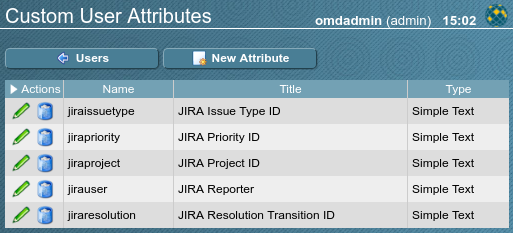
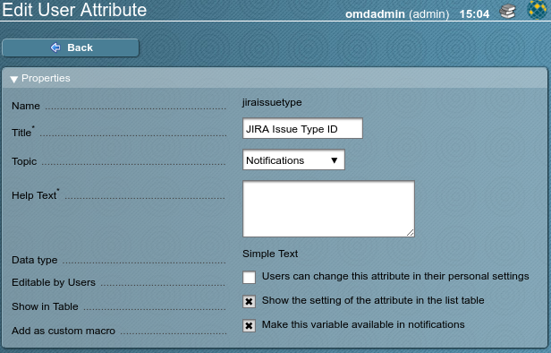

# Description #

The JIRA notification plugin talks to a JIRA instance via its API to create issues when notifications are created. It closes the issue as soon as the monitered state is OK again.

To do this it needs two custom fields in the issue type that gets used:

* `monitoring-host` for the hostname
* `monitoring-service` for the service description

If both custom fields do not exist, the automatic issue resolution will not work.

# Prerequisites #

The notification plugin needs the JIRA Python module. This module has to be installed by running

    pip install jira

as the site user. This will install a number of Python modules.

# Documentation #

The JIRA notification plugin uses several environment variables set by the accompanying WATO plugin or set by custom user attributes. I.e. you can have different monitoring users creating issue in different JIRA projects.

`NOTIFY_PARAMETER_*` variables are set in the notification rule by the WATO plugin, `NOTIFY_CONTACT_*` variables are set from user custom attributes that have to be configured to be used in notifications.

The custom user attributes should be defined as this:

 

## NOTIFY_PARAMETER_URL ##

This contains the JIRA base URL. It is set for each notification rule, i.e. you can create issues in different JIRA instances with multiple notification rules.

## NOTIFY_PARAMETER_USERNAME ##

This is the JIRA API username for authentication.

## NOTIFY_PARAMETER_PASSWORD ##

This is the JIRA API password for authentication.

## NOTIFY_PARAMETER_PROJECT or NOTIFY_CONTACT_JIRAPROJECT ##

The numerical JIRA project ID. If not set, it will be retrieved from a custom user attribute named `jiraproject`. If that is not set, the notification will fail.

## NOTIFY_PARAMETER_ISSUETYPE or NOTIFY_CONTACT_JIRAISSUETYPE ##

The numerical JIRA issue type ID. If not set, it will be retrieved from a custom user attribute named `jiraissuetype`. If that is not set, the notification will fail.

## NOTIFY_PARAMETER_PRIORITY or NOTIFIY_CONTACT_JIRAPRIORITY ##

The numerical JIRA priority ID. If not set, it will be retrieved from a custom user attribute named `jirapriority`. If that is not set, the standard priority will be used.

## NOTIFY_PARAMETER_RESOLUTION or NOTIFY_CONTACT_JIRARESOLUTION ##

The numerical JIRA resolution transition ID. If not set, it will be retrieved from a custom user attribute named jiraresolution.

## NOTIFY_CONTACT_JIRAUSER ##

This is the optional username that is used as the reporter for the new issue. If this is not set the issue will be created with the authenticated user as reporter.

## NOTIFY_PARAMETER_MONITORING ##

Configure the base URL for the Monitoring Web-GUI here. Include the site name. This is used to add a simple link in the newly created issue pointing back to the monitoring site. The URL specified here gets the content of `NOTIFY_HOSTURL` or `NOTIFY_SERVICEURL` appended.
